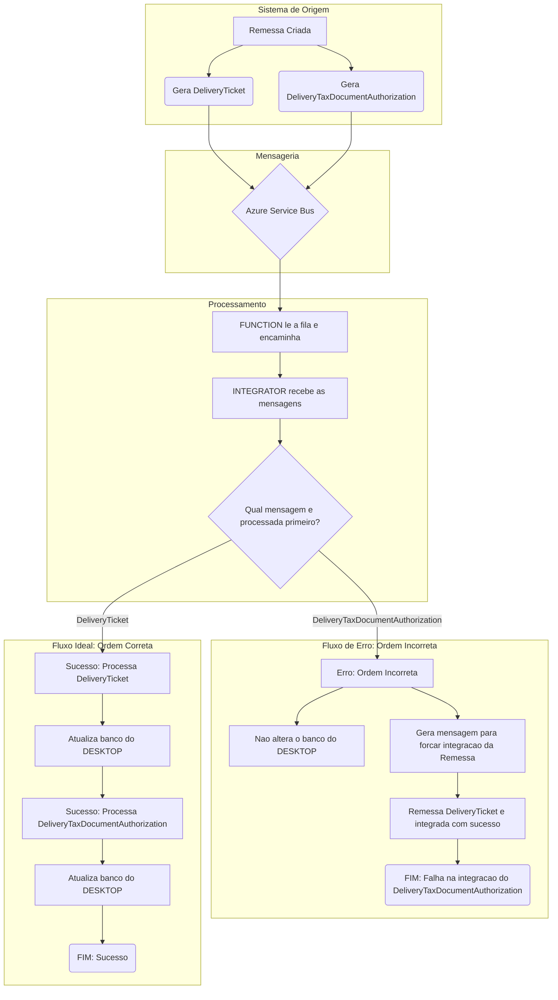
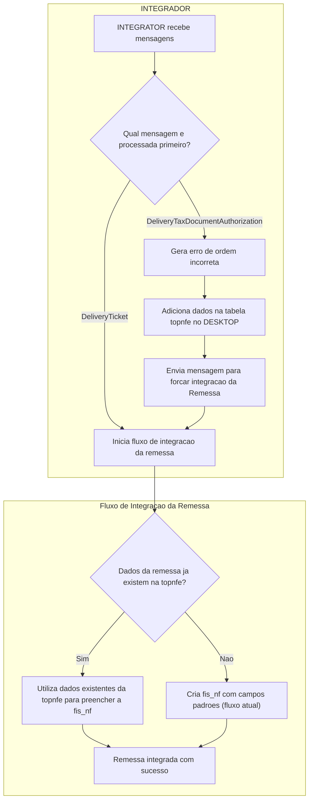

# Problemas
## Problema 1
Não integrando na topnfe
### Causa
Uma aspa simples ao tentar inserir no sql na mensagem de DeliveryTicket.
### Solução 1
Adicionar tratativa para limpar a aspa

## Problema 1
Não integrando na topnfe
### Causa
Fluxo de integração força integração da remessa em caso de ordem invertida mas perde a mensagem de autorização
### Solução 1
Corrigir fluxo para o novo.

#### Fluxo atual

#### Fluxo novo

# Casos de teste

## ✅❌ Caso 1: Fluxo correto

- **Pré-condições:**
    - Configurar central para emitir nota
    - Entrega disponível para emissão de remessa
    - 
- **Passos do Teste:**
    1. Emitir remessa/nota no DISPATCH
    2. No DESKTOP, remover todos os registros integrados (fis_nf, con_nf, topnfe.nfe e seus respectivos items)
    3. Forçar integração do DeliveryTicket
    4. Verificar se a fis_nf foi inserida como padrão
    5. Forçar integração DeliveryTaxDocumentAuthorization
- **Resultado Esperado:** É esperado que inicialmente a fis_nf esteja inserida com valores padrões e em seguida, que os dados estejam todos preenchidos corretamente no DESKTOP
- **Status:** ✅ PASSOU | ❌ FALHOU
- **Observações:** 

## ✅❌ Caso 1: Fluxo invertido

- **Pré-condições:**
    - Configurar central para emitir nota
    - Entrega disponível para emissão de remessa
    - 
- **Passos do Teste:**
    1. Emitir remessa/nota no DISPATCH
    2. No DESKTOP, remover todos os registros integrados (fis_nf, con_nf, topnfe.nfe e seus respectivos items)
    3. Forçar integração apenas do DeliveryTaxDocumentAuthorization
- **Resultado Esperado:** É esperado que no elastic seja exibido uma mensagem de DeliveryTaxDocumentAuthorization, em seguida uma de ForceDeliveryTicket, uma de DeliveryTicket e que os dados estejam todos preenchidos corretamente no DESKTOP
- **Status:** ✅ PASSOU | ❌ FALHOU
- **Observações:** 

